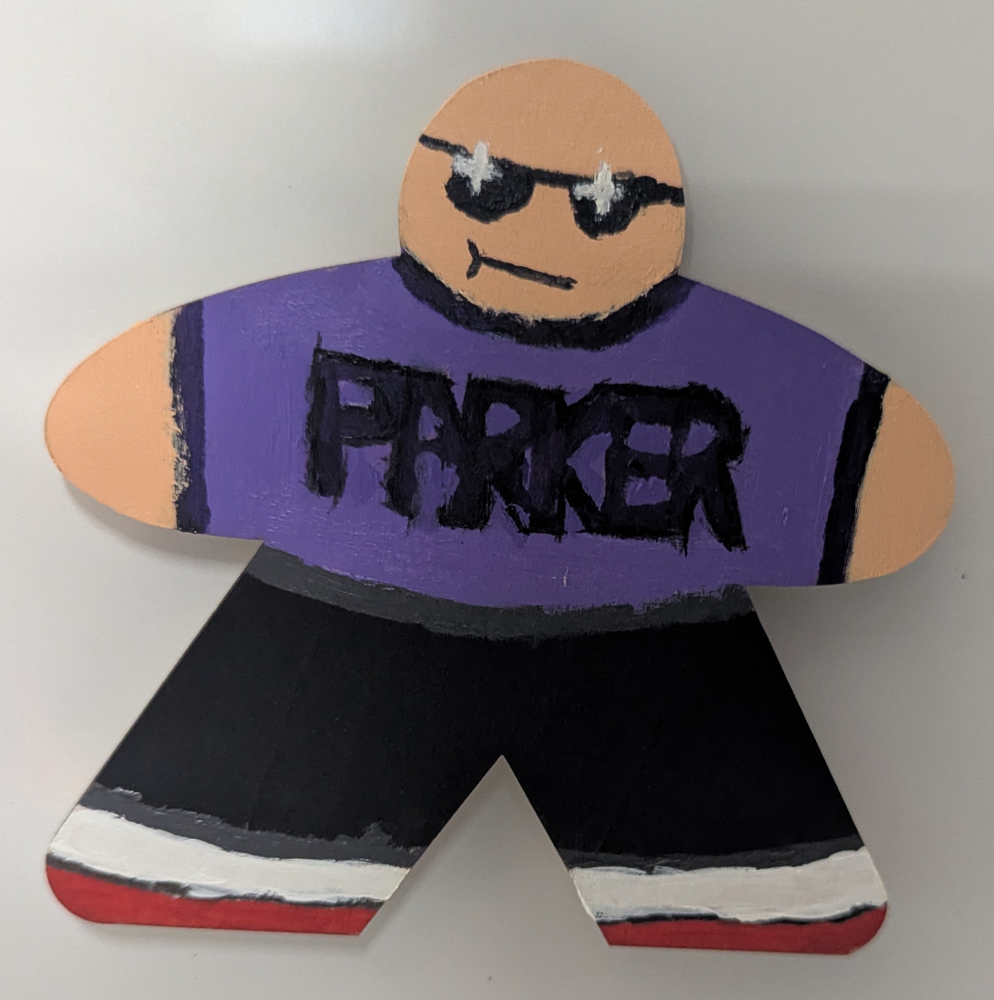

# Make Your Own Meeple

<!--toc:start-->
- [Make Your Own Meeple](#make-your-own-meeple)
  - [Overview](#overview)
    - [Maker Goal](#maker-goal)
    - [Workspace Staff Goal](#workspace-staff-goal)
  - [Required Materials](#required-materials)
  - [Prep Steps](#prep-steps)
    - [Cut Out Meaples](#cut-out-meaples)
    - [Set out Paint Materials](#set-out-paint-materials)
    - [Set up a Hot Glue Station.](#set-up-a-hot-glue-station)
  - [Student Work Phase.](#student-work-phase)
    - [DEMO Cutting out a Meeple (Optional)](#demo-cutting-out-a-meeple-optional)
    - [DEMO Painting a Meeple.](#demo-painting-a-meeple)
    - [DEMO Attaching a Magnates Meeple.](#demo-attaching-a-magnates-meeple)
    - [Work Time](#work-time)
<!--toc:end-->

## Overview

### Maker Goal
As a right of passage, we will be making a Meeple and adding it to the Maker Space Meeple board.
Meeple is a personification of self, it comes from board game terminology. 

\

### Workspace Staff Goal
Show people that it is easy to get into making.

## Required Materials
- 1/4in plywoold, 4inX4in per (participant + 1 for demo)
- Tables Cloths 
- Acrylic paint 
- Water cups 
- Paint trays
- Hot glue gun
- Spare glue
- Magnates.

## Prep Steps
### Cut Out Meaples
- See [laser instructions](../../Laser_Materials.md) for using the lazor.
- [Meeple file](./assests/Meeple.jpg)

### Set out Paint Materials
- Tables Cloths 
- Acrylic paint 
- Water cups 
- Paint trays

### Set up a Hot Glue Station. 
- Hot glue gun
- Spare glue
- Magnates.

## Student Work Phase.

### DEMO Cutting out a Meeple (Optional)
If you are going to do this make sure to prep for it **Before** people show up.

### DEMO Painting a Meeple.
Add:
- Pants
- Shirt
- Face

### DEMO Attaching a Magnates Meeple.
1) Turn on Hot glue gun
1) Place a Dime sized glob of hot glue to the center back of the meeple.

    \
1) Push Magnates into the meeple.

    \
3) Wait for it to cool
4) Stick it on the wall.

### Work Time
Set the students loose.
Assist anyone having trouble.

