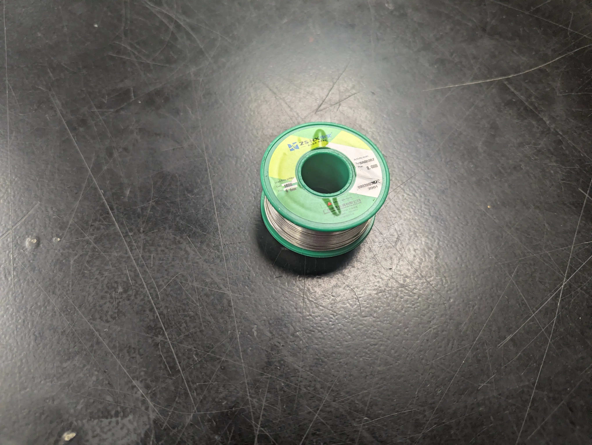
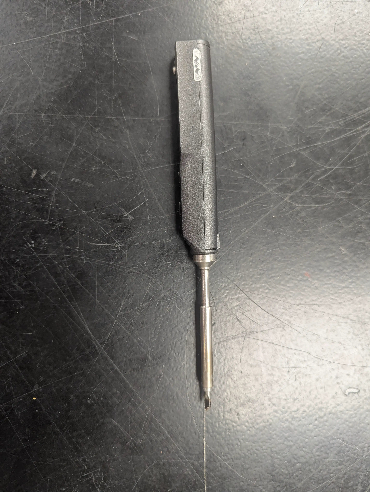
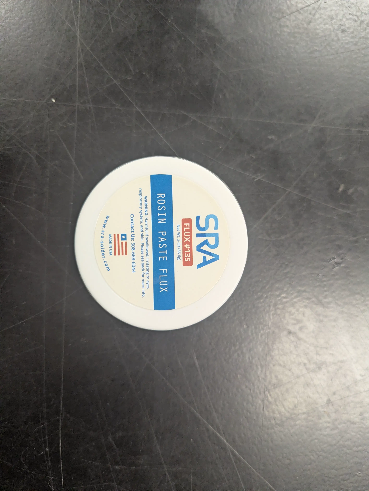
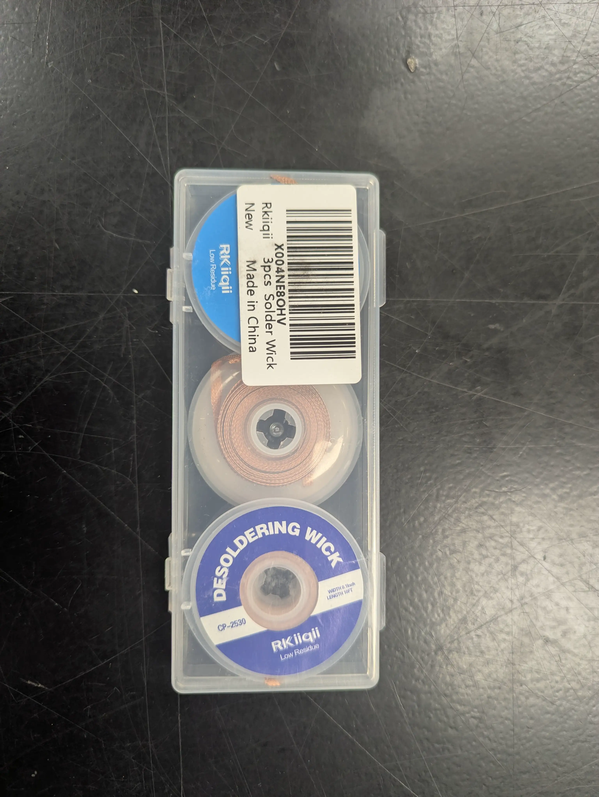
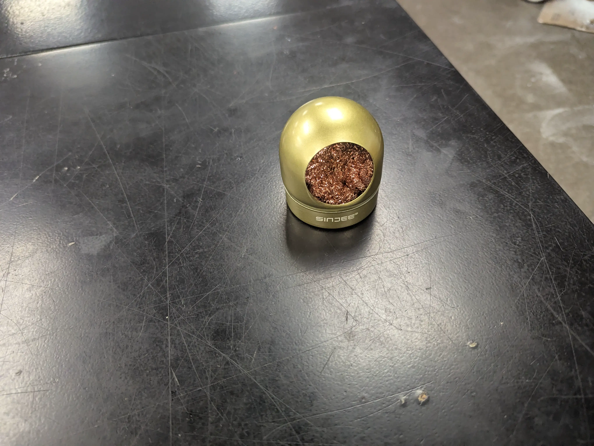
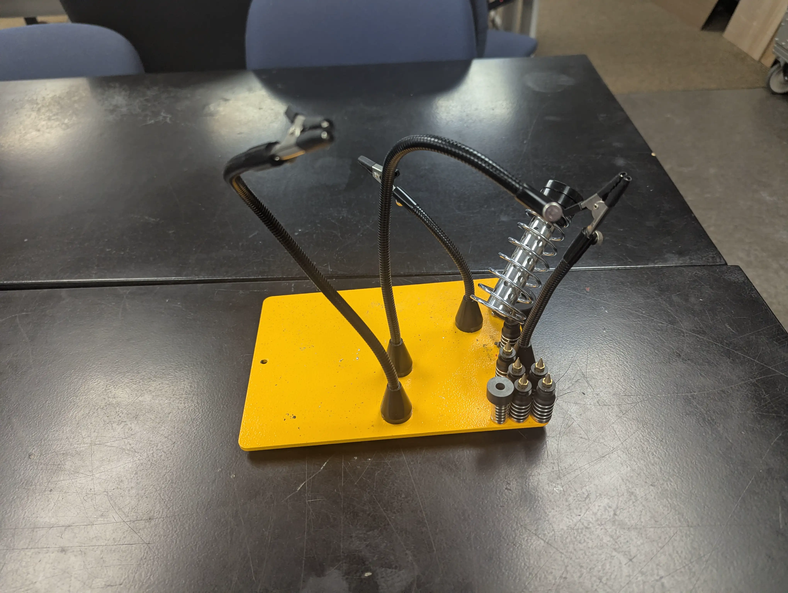
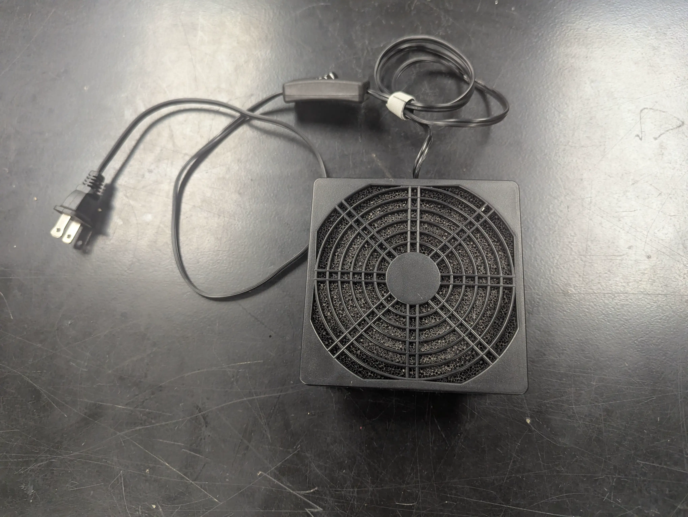

# Soldering
Soldering is use to from an electrical connection.
This electrical connection is formed by melting a conductive material (solder) to "glue" the two pieces together.

NOTE: This is only an electrical connection, If you expect mechanical strain, add additional [Strain Relief](../../glossary.md#strain-relief)

## Location in the Workspace.
The soldering equipment is located on a table in the north east corner of the main workroom.

## Key Materials/Tools
| Materials/Tools| Description | Image|
|---|---|---|
| Solder | The material that is melted and forms the electrical connection (solder joint). |  |
|Soldering Iron| A tool that is used to heat up the work piece **This gets vary hot (400C)**| |
|Flux| A chemical that is used to clean the work piece in order to insure a strong connection. **Note:** Flux can be applied separately, **however** most solder also include some flux.| |
|Desolder Braid| Copper wire braid that solder likes to stick to. Used to remove solder from a solder joint.| |
|Brass Wool| Used to clean the soldering iron.| |
|Helping Hands| Adjustable "arms" that can be used to hold a work piece.| |
|Fume Extractor| Filters and removes some of the harmful fumes generated when soldering.| |

## Instructional Video
1) [How to solder](https://youtu.be/jz67KgHzXVw?si=aL7bk_ATckGAEahw&t=441)
2) [Fixing bad solder joins](https://youtu.be/jz67KgHzXVw?si=c1cx6Fg44ukwF0lq&t=580)
