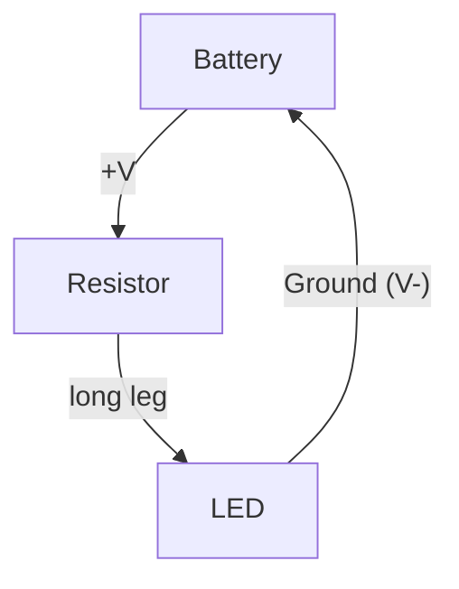

# Powering an LED with a Battery.
Goal: This is intended to be your first simple circuit.

```mermaid
graph TD
    Battery-- +V-->Resistor
    Resistor-- long leg-->LED
    LED--Ground (V-)-->Battery
```
