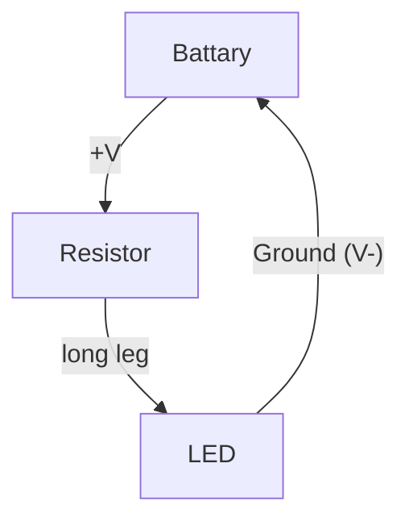

# Controlling a Led with a Button.
Goal: This is intended to be your first simple circuit.

```mermaid
graph TD
    Battary-- +V-->Resistor
    Resistor-- long leg-->LED
    LED--Ground (V-)-->Battary
```
